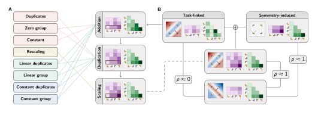

# Parameter symmetries determine representational geometry in overparameterized nonlinear networks

Code to reproduce figures from our paper "[Parameter symmetries determine representational geometry in overparameterized nonlinear networks](https://openreview.net/forum?id=CT8TbdqYmn)".

<p align="center">
  
</p>

## Abstract

Representations are routinely used in machine learning, psychology, and neuroscience to probe the computations of biological and artificial systems. Yet it remains unclear to what extent computation constrains representation in artificial neural networks. One key obstacle is that these networks admit **parameter symmetries**: transformations of the parameters that preserve function exactly while reshaping representational geometry. Here we show that known parameter symmetries act on representations through just three primitives: **addition, duplication, and scaling**. This yields a closed-form descriptor of representational geometry as a sum of task-linked features and symmetry-induced noise. This decomposition further provides analytic bounds on representational similarity under parameter symmetries, revealing when functionally equivalent networks can become arbitrarily dissimilar. Finally, we identify privileged representational geometries, which weight features by their computational importance and recover a stable link between representation and computation. Overall, our results delineate when representation can support inferences about computation, and when it cannot.

## Installation

This project uses [`uv`](https://docs.astral.sh/uv/) for dependency management. With `uv` installed, clone the repository and sync the environment:

```bash
git clone https://github.com/mrvnthss/symmetries-representational-geometry.git
cd symmetries-representational-geometry
uv sync
```

This creates a virtual environment and installs the `symmetries` package together with all dependencies pinned in `uv.lock`. JAX is resolved per-platform (CUDA on Linux, CPU/Metal elsewhere).

## Reproducing the figures

Every figure in the paper is generated by a self-contained [marimo](https://marimo.io/) notebook under `notebooks/figures/`. The notebooks resolve their style sheet and output paths relative to the `notebooks/` directory, so they must be launched from there; the `--directory notebooks` flag handles this (notebook paths are then given relative to `notebooks/`). Open a notebook interactively:

```bash
uv run --directory notebooks marimo edit figures/main/fig1/components.py
```

or run it as a read-only app:

```bash
uv run --directory notebooks marimo run figures/main/fig2/components.py
```

| Notebook                                  | Output                                |
| ----------------------------------------- | ------------------------------------- |
| `.../main/fig1/components.py`             | Figure 1 components                   |
| `.../main/fig1/symmetries.py`             | Figure 1 symmetry-group illustrations |
| `.../main/fig2/components.py`             | Figure 2 components                   |
| `.../appendix/fig_a1.py` ... `fig_a3.py`  | Appendix activation decompositions    |
| `.../templates/hidden_unit_components.py` | Reusable hidden-unit template assets  |

Generated assets are written into `figures/`.

## Repository structure

```
src/symmetries/       # core library (import symmetries)
  activations.py      # JAX activation-function registry
  geometry2d.py       # build networks from geometric parameters
  mlp.py              # minimal Equinox MLP
  training.py         # JIT training loop + multi-seed sweeps
  rsa.py              # representational similarity analysis
  distances.py        # distance / similarity measures
  clustering.py       # hierarchical clustering of solutions
  xor.py              # XOR task + analytical solutions
  plotting.py         # 2D network visualization
  svg.py, colors.py   # figure-generation helpers
notebooks/            # marimo notebooks (figures, experiments, utils)
figures/              # figure components and rendered outputs
tests/                # unit tests
```

## Citation

```bibtex
@inproceedings{theiss2026parameter,
    address   = {Seoul, South Korea},
    title     = {Parameter symmetries determine representational geometry in overparameterized nonlinear networks},
    url       = {https://openreview.net/forum?id=CT8TbdqYmn},
    booktitle = {{ICML} 2026 {Workshop} on {Weight}-{Space} {Symmetries}: {From} {Foundations} to {Practical} {Applications}},
    author    = {Theiss, Marvin and Braun, Lukas and Saxe, Andrew M. and Grant, Erin},
    year      = {2026},
}
```

## License

Released under the [MIT License](LICENSE).
